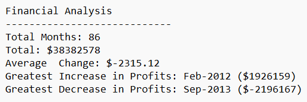

# python-homework
## This repo contains my module 2 assignment. It marked the strat of my journey of learning Python. It allowed me to demonstrate my skills with the following area:
- Financial Analysis with Python
- CSV reader
- Pathlib
- For loop
- If statement
- Appropriate indentation
- Write to a text file in Python

## Findings
I was able to utilised what I have learned in Python, and generate a financial analysis data based on the budget data.

## Implementation
The skills I acquired in this module allows me to automate the production of financial analysis data, such as the total number of months, the total profit and loss, average change in budget, greatest increase in profits, greatest decrease in profits and more.
